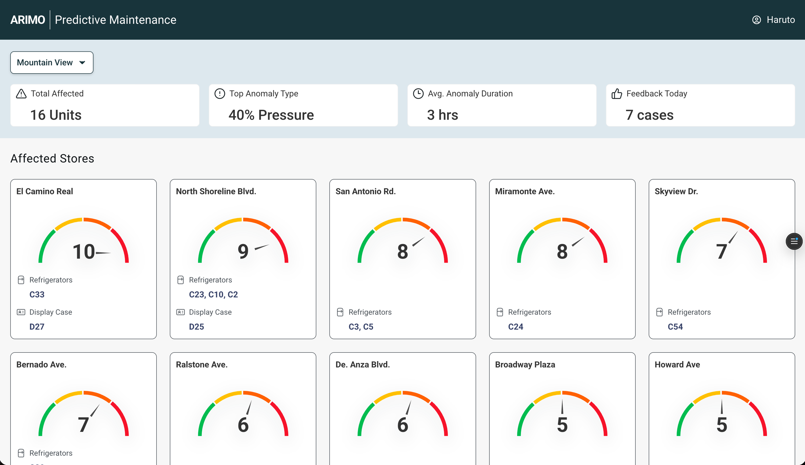

# Predictive Maintenance Dashboard



A predictive maintenance dashboard for industrial equipment monitoring, built from Figma designs using an AI-assisted workflow.

[Live demo](https://pm-dashboard-j1i6.vercel.app) · [Design system](https://pm-dashboard-j1i6.vercel.app/design-system)

## Built With

- React 19 + Vite
- Tailwind CSS v4
- shadcn/ui (New York style)
- React Router
- Roboto (Google Fonts)
- Vercel (hosting + auto-deploy)
- Figma + Figma MCP plugin (design source)

## The Story

This dashboard was built by a product designer using Cursor with AI as a coding collaborator — no traditional development experience required. The Figma file was read directly through Cursor's Figma MCP plugin, and the React app was assembled through agent mode, Cmd+K inline edits, and a `.cursorrules` file that kept the AI aligned with the design system.

## What It Does

- Custom design system extracted from Figma: navy brand chrome, semantic risk colors, and Roboto typography.
- 12 affected-store cards with animated SVG risk gauges built as a reusable component.
- KPI summary cards for total affected units, anomaly type, anomaly duration, and feedback today.
- Multi-page routing: `/` for the dashboard and `/design-system` for token documentation.
- Responsive layout tuned for dashboard review and presentation.
- Vercel deployment with auto-redeploy from GitHub.

## Tech Stack

- React 19 + Vite
- Tailwind CSS v4
- shadcn/ui, New York style
- React Router
- Roboto via Google Fonts

## Running Locally

```bash
npm install
npm run dev
```

Then open the local URL printed by Vite, usually `http://localhost:5173`.

## What I Learned

- How to speak to AI in design language rather than developer language.
- How to iterate visually with annotated screenshots and precise UI feedback.
- When to ship a working product and when to polish further.
- The full GitHub + Vercel deployment workflow, from local commit to live site.

## Acknowledgments

Built with Cursor as the AI-assisted development environment and Anthropic models as coding collaborators.